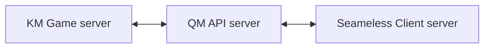
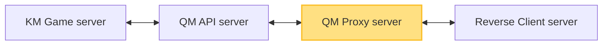

# Reverse API 說明

KM 針對特定客戶做 Reverse API 接入，每間客戶的API都不一樣，因此紀錄客戶各自的API資訊，以便快速查找問題及支援。

---

* **一般Seamless客戶API流程** :

* **Reverse客戶API流程** :

    * **`QM Proxy server`**: 
		1. 這是個虛擬server，讓我們的 QM API server 先打到這個虛擬server (模擬Seamless流程概念)
		2. 虛擬Server 會執行Reverse API的事務，送出API請求給Reverse Client Server
		

---
最後更新：2026-03-27  
維護者：Jerry Yeh